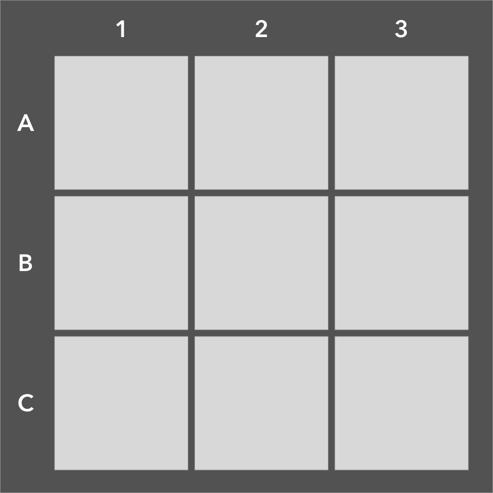

# Project: Mini Battleship
You are going to create your own small version of the classic board game Battleship. This is a terminal-based game.

This project will significantly increase your coding skills and help you master fundamental data structures and algorithms.

## 📣  Getting Started:
1) Download the readline-sync npm package for this project.
2) You WILL NOT need HTML/CSS to build this game. It is 💯 terminal-based, using only JavaScript.
3) Read the TIPS at the bottom of this document 🙂

**IMPORTANT**: Please create a new .js file for each "Part" of this project and include it in the same project folder. This will help me review each "Part" vs reviewing a final "Part 4" version. (i.e. part-1.js, part-2.js, etc)

## 🛠 Requirements: Part 1
1) When the application loads, print the text, "Press any key to start the game."
2) When the user presses the key, your code will randomly place two different ships in two separate locations on the board. Each ship is only 1 unit long (In the real game ships are 2+ in length).
3) The prompt will then say, "Enter a location to strike ie 'A2' "
4) The user will then enter a location. If there is a ship at that location the prompt will read, "Hit. You have sunk a battleship. 1 ship remaining."
5) If there is not a ship at that location the prompt will read, "You have missed!"
6) If you enter a location you have already guessed the prompt will read, "You have already picked this location. Miss!"
7) When both of the battleships have been destroyed the prompt will read, "You have destroyed all battleships. Would you like to play again? Y/N"
8) If "Y" is selected the game starts over. If "N" then the application ends itself.

## 🛠 Requirements: Part 2
Only go to this step when you have successfully finished part 1.

Now we are going to make the game a little more realistic.

1) Rewrite the code so that we use letters A-J and numbers 1-10. This will create a 100 unit grid.
2) If you haven't already, create a function that builds the grid. This function will take a single number argument to build the grid accordingly. (i.e. buildGrid(3) will create a 3x3 grid (9 units), buildGrid(5) will create a 5x5 grid (25 units) buildGrid(10) creates a 10x10 (100 units), etc). 
3) The computer will now place multiple ships in this format:
    - One two-unit ship
    - Two three-unit ships
    - One four-unit ship
    - One five-unit ship
4) Keep in mind that your code cannot place two ships on intersecting paths
5) Ship placement should be random (horizontally and vertically placed) and not manually placed by you in the code
6) Ships must be placed within the grid boundaries
7) The game works as before, except now, all ships must be destroyed to win.